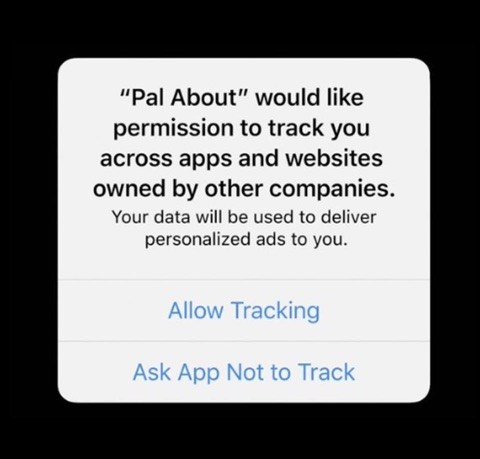
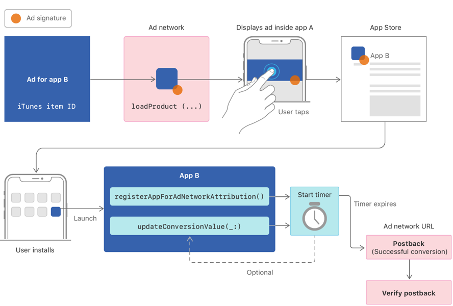

# IDFA、iOS14新隐私政策和 SKAdNetwork 框架

更新日期：2021-01-29


#### 最新动态 01-29 [source](https://developer.apple.com/cn/news/?id=8rm6injj)

在即将发布的 iOS 和 iPadOS 版本中，苹果将对 SKAdNetwork 进行增强并添加对 app 的“私人点击测量（Private Click Measurement）”支持，以帮助广告网络更好地对这些平台的 app 中广告进行归因。“私人点击测量”可在保护用户隐私的同时，对引导用户到网站的广告活动进行测量。

更多详细信息将在稍后公布。


## 概要

2018年5月，苹果推出了一个新API，叫做 SKAdNetwork，可以在保护用户隐私的同时进行APP归因，但没有得到广泛使用。


直至2020年，在6月22日举行的WWDC（全球开发者大会）上，苹果宣布了很多新的隐私政策。在 iOS 14 系统中，App 在获取 IDFA 时将和获取地理位置、相机权限一样，需要明确请求用户的许可。这就意味着如果不能经过用户允许，数据不能被用于定向广告，广告商不能共享用户的信息，这让过去通过 IDFA 来实现的广告归因和效果衡量变得接近无效。





这个方案需要以下参与方：

* 广告网络（Ad Network）：对广告签名，当广告带来转化时接收安装通知
* 来源应用（Source Apps）：展示来自广告网络的广告
* 广告主应用（Advertiser Apps）：出现在签名的广告中


广告网络需跟苹果注册，开发者们需在 APP 中配置相关的广告网络。


以下图表描述了安装验证的流程，App A 指展示广告的来源APP，App B 指用户安装的广告主APP。




图片来自Apple


当用户点击广告时，一个带有签名信息的APP Store产品界面呈现出来，签名信息标记了此次广告活动。如果用户安装并且打开了APP，设备发送一个安装验证通知给广告网络。这个由Apple签名的通知包括广告活动ID，但是不含用户或设备相关的数据。通知还可以包含一个转化数值和来源应用ID，这个取决于苹果设定的一个隐私阈值。


使用广告网络API的各参与方需承担以下责任。


广告网络的责任：

* 在苹果注册自己的广告网络ID，提供给开发者。
* 为来源应用提供签名的广告。
* 通过注册时填写的URL接收安装验证通知
* 验证通知。


来源应用的责任：

* 将广告网络的ID添加到应用的 Info.plist 文件。
* 展示签过名的广告。


广告主应用的责任：

* 发起应用安装验证通知，方法：`registerAppForAdNetworkAttribution()` 或 `updateConversionValue(_:)`。
* 可选地，更新转化数值，方法：`updateConversionValue(_:)`。


设备在计时结束后，会自动发送安装验证。


## 广告主 - 注册App用于广告网络归因 registerAppForAdNetworkAttribution

验证作为广告结果安装的应用程序的首次启动。


### 函数声明

```objective-c
+ (void)registerAppForAdNetworkAttribution;
```

### 说明

应用在首次启动时调用此函数或  `updateConversionValue:`。


如果此次安装有归因数据，那么首次调用 registerAppForAdNetworkAttribution 会生成通知，并且启动一个 24 小时计时器。再次调用就没有反应了。但是你可以调用 updateConversionValue: 提供转化数值并且重启计时器。


在计时器结束后的 0-24 小时内设备将安装通知发送给广告网络。广告网络在收到通知后必须进行验证。


## 广告主 - 更新转化数值 updateConversionValue

更新转化数值，并且验证作为广告结果安装的应用程序的首次启动。


### 函数声明

```objective-c
+ (void)updateConversionValue:(NSInteger)conversionValue;
```


### 参数

​	**conversionValue**

​	无符号的 6 bit 整数（0-63）。由广告主应用和广告网络决定此值的含义。默认为0。


### 说明

应用在首次启动时调用此函数或  `registerAppForAdNetworkAttribution` 。开发者可以在 24小时的循环周期内反复调用 updateConversionValue: 去更新转化数值。调用此方法有两个目的：


* 产生一个安装通知，是一个加密签名的数据包，用于验证是否来自广告
* 让应用提供或更新一个转化数值


转化数值是由广告网络或者广告主定义的 6 bit 值。App 来决定何时更新，在计时器结束前可以随意调用。每次调用，只要这个值比上一次大，计时器就会重新计时。当计时器结束，最后的数值将生效，并且继续调用 updateConversionValue: 无任何作用。


在计时器结束后的 0-24 小时内设备将安装通知发送给广告网络。只有发送的数据量达到苹果隐私的阈值，通知才会包含最后的转化数值。广告网络在收到通知后必须进行验证。


如果你不需要转化数值，那么只要调用 `registerAppForAdNetworkAttribution` 即可。


**在实践中，开发者可以仔细把握调用的时机，并且对数值做良好的定义，就能达到衡量广告用户质量的目的。**


## 参考资料

https://developer.apple.com/documentation/storekit/skadnetwork

[Registering an Ad Network](https://developer.apple.com/documentation/storekit/skadnetwork/registering_an_ad_network?language=objc)

[Configuring the Participating Apps](https://developer.apple.com/documentation/storekit/skadnetwork/configuring_the_participating_apps?language=objc)

[Generating the Signature to Validate an Installation](https://developer.apple.com/documentation/storekit/skadnetwork/generating_the_signature_to_validate_an_installation?language=objc)

[Ad Network Install Validation Keys](https://developer.apple.com/documentation/storekit/skadnetwork/ad_network_install_validation_keys?language=objc)

[`class func updateConversionValue(Int)`](https://developer.apple.com/documentation/storekit/skadnetwork/3566697-updateconversionvalue?language=objc)

[`class func registerAppForAdNetworkAttribution()`](https://developer.apple.com/documentation/storekit/skadnetwork/2943654-registerappforadnetworkattributi?language=objc)

[Verifying an Install Validation Postback](https://developer.apple.com/documentation/storekit/skadnetwork/verifying_an_install_validation_postback?language=objc)


